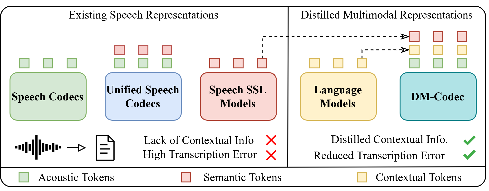
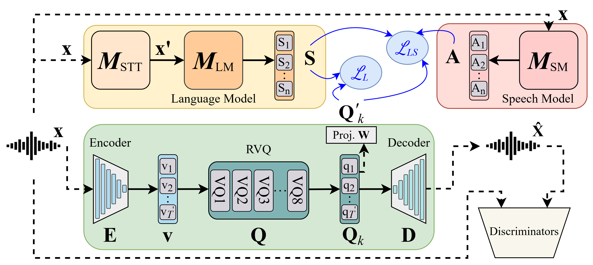

# DM-Codec: Distilling Multimodal Representations for Speech Tokenization

[](https://arxiv.org/abs/2410.15017)

This repository contains the source code for [DM-Codec](https://arxiv.org/abs/2410.15017).

As illustrated in **Figure 1**, DM-Codec introduces speech tokenization approaches using discrete acoustic, semantic, and contextual tokens. DM-Codec integrates these multimodal representations for robust speech tokenization, learning comprehensive speech representations.

<br>

The DM-Codec framework is further detailed in **Figure 2**. The framework consists of an encoder that extracts latent representations from the input speech signal. These latent vectors are subsequently quantized using a Residual Vector Quantizer (RVQ). We designed two distinct distillation approaches: (i) distillation from a language model, and (ii) a combined distillation from both a language model (LM) and a speech model (SM). These approaches integrate acoustic,semantic, and contextual representations into the quantized vectors to improve speech representation for downstream tasks.



## Status

- We have released code and trained model checkpoints.

More instructions and details will be provided soon.

## Model Checkpoints

| Model | Description |
|-------|-------------|
| [DM-Codec_checkpoint_LM_SM](https://drive.google.com/file/d/1pvrPcbUTUAlo2_iGLIIf7IFNJPfzmHbh/view?usp=drive_link) | Utilizes LM and SM-guided representation distillation approach uniting acoustic, semantic, and contextual representations into DM-Codec. |
| [DM-Codec_checkpoint_LM](https://drive.google.com/file/d/14DMrDzIssP-8qzXBG8v65ctF4WPA_Uyv/view?usp=drive_link) | Utilizes LM-guided representation distillation approach incorporating acoustic and contextual representations into DM-Codec. |


## Environment Setup

To set up the project environment, use one of the following:

- Install Python dependencies from [`requirements.txt`](requirements.txt)
- Or use Docker with the provided [`Dockerfile`](Dockerfile)


## Training Pipeline

The training workflow consists of three steps, each run via a Python file:

1. Data preprocessing  
   Run process_dataset.py to download a speech dataset from the Hugging Face Hub (e.g., "username/dataset_name"), select a split (e.g., "train"), segment audio into fixed-length chunks (e.g., 3 seconds), and optionally limit the dataset using a ratio (e.g., 10% for quick tests).

2. Representation extraction  
   Run extract_rep.py to generate features from multiple models: Semantic model (e.g., HuBERT from "facebook/hubert-base-ls960"), STT model (e.g., Wav2Vec2 from "facebook/wav2vec2-base-960h"), and Language model (e.g., BERT from "bert-base-uncased").  
   You can specify Hugging Face model IDs, layer selection ("avg", "last", or layer index number), file formats (e.g., flac, wav), validation size (as a percentage), and output directory.

3. Training  
   Run trainer.py with accelerate to train a model on the extracted representations.  
   Accepts options for model config, number of epochs, distillation teacher type ("combined", "llm", "hubert", etc.), target layer, and layer locking.

**Note:** For detailed explanation of the pipeline and design choices, please refer to the paper.

## Citation

If you use this work, please cite:

```bibtex
@misc{ahasan2024dmcodec,
      title={DM-Codec: Distilling Multimodal Representations for Speech Tokenization}, 
      author={Md Mubtasim Ahasan and Md Fahim and Tasnim Mohiuddin and A K M Mahbubur Rahman and Aman Chadha and Tariq Iqbal and M Ashraful Amin and Md Mofijul Islam and Amin Ahsan Ali},
      year={2024},
      eprint={2410.15017},
      archivePrefix={arXiv},
      primaryClass={cs.CL},
      url={https://arxiv.org/abs/2410.15017}, 
}
```

## License

[](LICENSE)

This project is licensed under the Apache 2.0 License - see the [LICENSE](./LICENSE) file for details.
